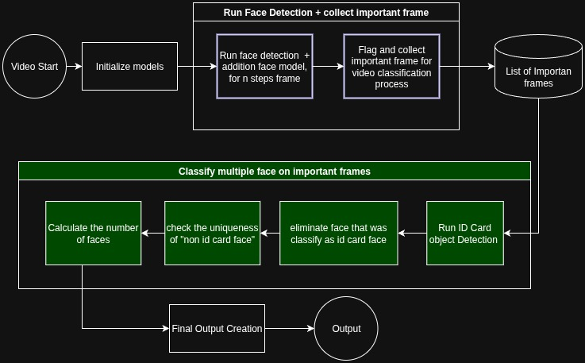

# Multi-Face Video Classifier

A robust binary classifier that analyzes videos to detect the presence of multiple live faces, distinguishing between faces on identity documents and live faces in the scene.

**Notes: This project will be put into private repo after the test assessment is done**
## Overview

This classifier analyzes video content and returns:
- **Class 0**: Single or no live faces detected (faces on ID cards are filtered out)
- **Class 1**: Multiple live faces detected simultaneously



The system uses advanced face detection (SCRFD), object detection for ID cards, and face recognition embeddings to accurately classify videos while filtering out faces appearing on identity documents.

## Method Evaluation Results

Short Report can be found here: [Google docs](https://docs.google.com/document/d/1XB7ve1DSaOkBgEwqTEHAK--lw9-cPpKEtHt0TXbcgak/edit?tab=t.0)
or on `assets/multiple_face_detection_report.pdf`

| Method Name                                                   | Main Benchmark (Veriff, 19 videos)     |                                      | Additional Edge Cases (4 videos)     |                                      |
|---------------------------------------------------------------|----------------------------------------|--------------------------------------|----------------------------------------|--------------------------------------|
|                                                               | **Precision**                          | **Recall**                           | **Precision**                          | **Recall**                           |
| RC1 - Baseline                                                | 58.30%                                 | 100%                                 | -                                      | -                                    |
| RC2v1 - One-shot Clip                                         | -                                      | -                                    | -                                      | -                                    |
| RC2v2 - One-shot Clip (face removed)                          | -                                      | -                                    | -                                      | -                                    |
| RC3 - Grounding DINO                                          | 75.00%                                 | 42.90%                               | -                                      | -                                    |
| RC4 - Grounding DINO + ID Card Classification                | 87.50%                                 | 100%                                 | -                                      | -                                    |
| RC5 - RC4 + Additional Text Query                             | **100%**                               | **100%**                             | **0%**                                 | **0%**                               |
| RC6 - RC5 + Face Recognition + Face Occlusion Check           | **100%**                               | **100%**                             | **50%**                                | **33.30%**                           |


## Features

- **Advanced Face Detection**: Uses InsightFace SCRFD models with ONNX Runtime
- **ID Card Filtering**: Automatically detects and filters faces on identity documents  
- **Face Recognition**: Employs embedding similarity to identify unique individuals
- **GPU Acceleration**: CUDA support for faster processing
- **Flexible Input**: Supports single videos or directory batch processing

## Installation

### Method 1: Virtual Environment Setup

1. **Clone and setup**
   ```bash
   git clone <repository-url>
   cd multi-face-video-classifier
   ./setup_venv.sh  # Linux/Mac
   ```

2. **Activate environment**
   ```bash
   source venv/multi-face-classifier/bin/activate
   ```

### Method 2: Docker Setup (Recommended)

For containerized deployment with automatic GPU/CPU detection:

1. **Build Docker image**
   ```bash
   ./build_docker.sh
   ```
   The script automatically detects your system and builds the appropriate image:
   - **GPU system**: Builds optimized GPU image with CUDA support
   - **CPU system**: Builds lightweight CPU-only image

2. **Run with Docker**
   ```bash
   # Process all videos in a folder (recommended)
   ./run_docker.sh folder_name
   
   # Examples:
   ./run_docker.sh additional_vid    # Process input/additional_vid/
   ./run_docker.sh veriff_videos     # Process input/veriff_videos/
   ```

## Usage

### Using Virtual Environment

Always activate the environment before running commands:
```bash
source venv/multi-face-classifier/bin/activate
```

### Basic Usage

**Single Video:**
```bash
python bin/run_multi_face.py /path/to/video.mp4 --output /path/to/output_folder/
```
**Batch Processing (Recommended):**
```bash
python bin/run_multi_face.py /path/to/video/folder/ --output /path/to/output_folder
```
**Batch Processing test on old version:**
```bash
python bin/run_multi_face.py /path/to/video/folder/ --output /path/to/output_folder_rc5 --dev --mode rc5
```

The script automatically detects if the input is a file or directory and processes accordingly.
it will also save a json file of each video, which contains the basic info and classification results

## Evaluation

After processing the video folder and obtaining the output, you can evaluate the model's performance using `evaluate_model_performance.py`.

To assess the model with metrics such as precision, recall, accuracy, False Acceptance Rate (FAR), and False Rejection Rate (FRR), run the script as follows:

```bash
cd tools/

python evaluate_model_performance.py --labels-file /path/to/labels.txt --predictions-dir /path/to/results/
```

### Example Output
```
Loading ground truth from: ../assets/labels/labels.txt
Loading predictions from: ../output/results/
Found 17 common videos
==================================================
OVERALL PERFORMANCE RESULTS
==================================================
Accuracy:   1.000 (100.0%)
Precision:  1.000 (100.0%)
Recall:     1.000 (100.0%)
FAR:        0.000 (0.0%)
FRR:        0.000 (0.0%)

Confusion Matrix: TP=7, TN=10, FP=0, FN=0
```

**Label file format (TSV):**
```
video	label
video1	0
video2	1
```

**Available datasets:**
- Main benchmark: `assets/labels/labels.txt` (19 videos)
- Edge cases: `assets/labels/labels_edge.txt` (4 videos)

### Output Files

For each processed video, the system generates:
- `{video_name}_out.json`: Classification results
- `{video_name}_detected.mp4`: Visualization video (if `--visualize` is used)

**Processing Modes: Only available with command `--dev`**
- `rc1`: Basic face detection
- `rc3`: Face detection with card counting
- `rc4`: Face detection with card filtering
- `rc5`: Advanced face detection with card filtering  
- `rc6`: Most advanced with face recognition (recommended + default)

## Example Workflows

### Batch Processing Multiple Videos

```bash
# Process all videos in a directory
python bin/run_multi_face.py /path/to/video/dataset/ \
    --output /path/to/results/ \
    --max-frames 50 \ 
    
# best value is 50

# Results will be saved as:
# /path/to/results/video1_out.json
# /path/to/results/video2_out.json
# ...
```

### Development and Testing

```bash
# Quick test with fewer frames
python bin/run_multi_face.py test_video.mp4 --max-frames 20

# CPU testing (no GPU required)
python bin/run_multi_face.py test_video.mp4 --device -1

# Create visualization for analysis (don't use this, currently will make the folder messy, require a lot of fixing)
python bin/run_multi_face.py test_video.mp4 --visualize 
```

## Hardware Requirements

**Recommended for Performance:**
- GPU: NVIDIA GPU with CUDA support
- VRAM: 4GB+ for optimal performance

## Troubleshooting

**Common Issues**:
- **Import Errors**: Activate virtual environment first
- **GPU Issues**: Use `--device -1` for CPU processing

## Docker Usage Guide

### Quick Start

The Docker setup provides automated GPU/CPU detection and simplified folder-based processing:

```bash
# 1. Build the appropriate Docker image for your system
./build_docker.sh

# 2. Place videos in input folders
mkdir -p input/my_videos
cp /path/to/videos/* input/my_videos/

# 3. Process all videos in the folder
./run_docker.sh my_videos
```

### Automated Build Script

The `build_docker.sh` script automatically:
- **Detects GPU availability** and Docker NVIDIA runtime support
- **Builds GPU image** (`multi-face-classifier-gpu`) if GPU detected
- **Builds CPU image** (`multi-face-classifier`) if no GPU available
- **Uses optimized Dockerfiles** for each configuration

```bash
./build_docker.sh
```

**Example Output:**
```
Multi-Face Video Classifier - Docker Build Script
==================================================
✓ NVIDIA GPU detected and Docker GPU support available
Building GPU-optimized Docker image...
✓ Successfully built multi-face-classifier-gpu
Image: multi-face-classifier-gpu:latest

Build completed successfully!
Use ./run_docker.sh <folder_path> to run the classifier
```

### Automated Run Script

The `run_docker.sh` script provides intelligent processing with folder-based input:

#### Basic Usage
```bash
# Process all videos in input/folder_name/
./run_docker.sh <folder_name>

# Examples:
./run_docker.sh additional_vid     # Process input/additional_vid/
./run_docker.sh test_videos       # Process input/test_videos/
./run_docker.sh veriff_dataset    # Process input/veriff_dataset/
```

#### Advanced Options
```bash
# Force CPU processing
./run_docker.sh my_videos --cpu

# Force GPU processing  
./run_docker.sh my_videos --gpu
```

### Directory Structure

Organize your videos using the following structure:

```
multi-face-video-classifier/
├── input/                          # Input folder for all video datasets
│   ├── additional_vid/             # Folder 1: Edge case videos
│   │   ├── edge1.mp4
│   │   ├── edge2.mp4
│   │   └── edge3.mp4
│   ├── veriff_videos/              # Folder 2: Main dataset
│   │   ├── veriff1.mp4
│   │   ├── veriff2.mp4
│   │   └── ...
│   └── test_videos/                # Folder 3: Test videos
│       ├── sample1.mp4
│       └── sample2.mp4
├── output/                         # Results automatically saved here
│   ├── edge1_out.json
│   ├── edge2_out.json
│   ├── veriff1_out.json
│   └── ...
├── build_docker.sh                 # Automated build script
└── run_docker.sh                   # Automated run script
```

### Processing Examples

#### Example 1: Process Edge Cases
```bash
# Copy videos to input folder
mkdir -p input/edge_cases
cp /path/to/edge_videos/* input/edge_cases/

# Process with GPU acceleration
./run_docker.sh edge_cases

# Results saved to output/ folder:
# - output/edge1_out.json
# - output/edge2_out.json
# - ...
```


### Advanced Options (not recommended to use, might have certain bugs and issues)

```bash
# Process with custom settings
python bin/run_multi_face.py /path/to/videos/ \
    --max-frames 50 \
    --device 0 \
    --output results/ \

# CPU-only processing
python bin/run_multi_face.py /path/to/videos/ --device -1


## Output Format

The classifier outputs JSON files with the following structure:

**Single Face Example (Class 0):**
```json
{
    "contain_multiple_live_faces": false,
    "n_faces": 1,
    "class": 0
}
```

**Multiple Faces Example (Class 1):**
```json
{
    "contain_multiple_live_faces": true,
    "n_faces": 2,
    "class": 1
}
```

